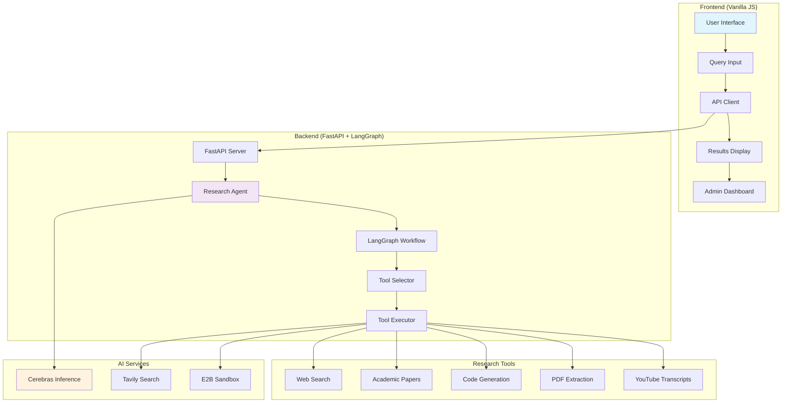
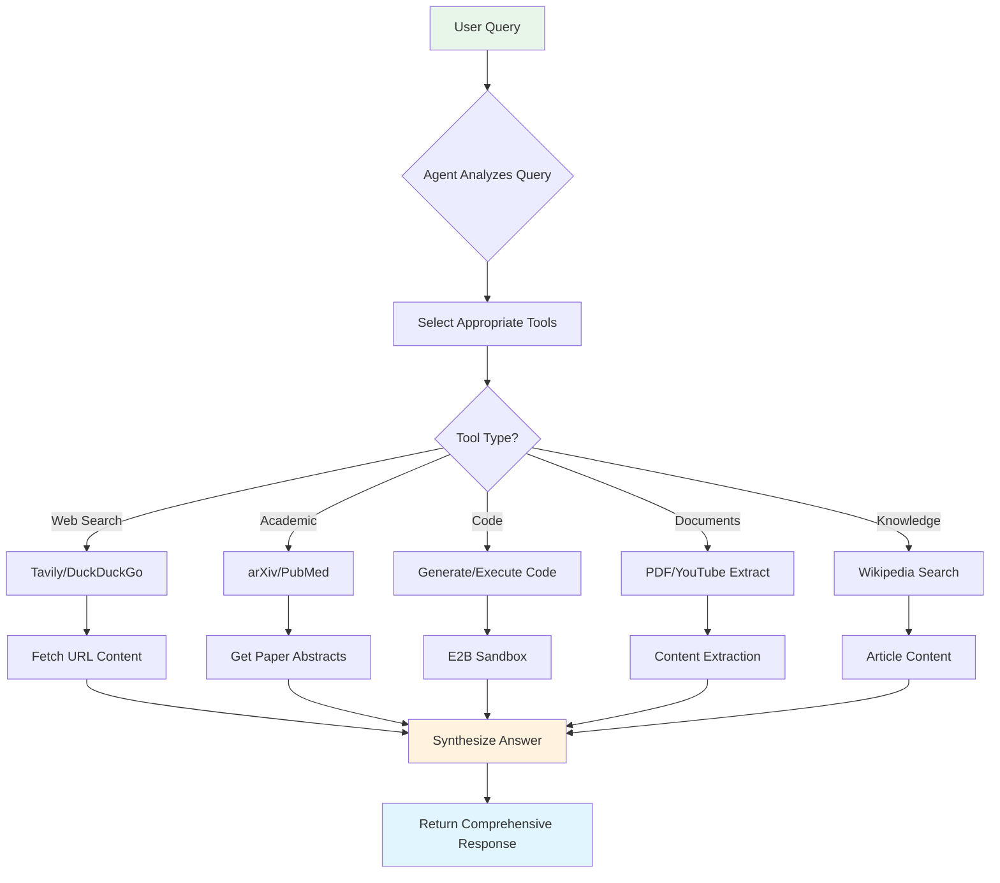
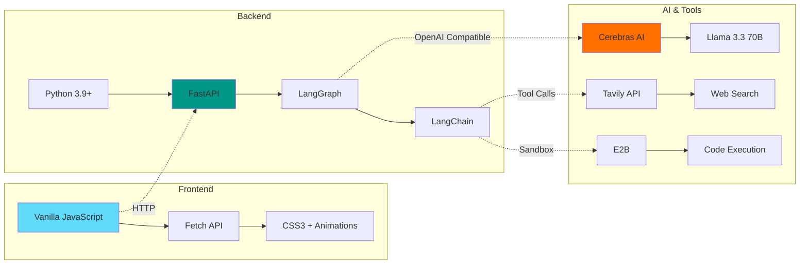

# 🔬 Research Agent - AI-Powered Research Assistant ✨

<div align="center">


**An intelligent research assistant powered by LangGraph and Cerebras AI that automatically gathers, analyzes, and synthesizes information from multiple sources**

[🎯 Features](#-features) • [🏗️ Architecture](#️-architecture) • [🚀 Quick Start](#-quick-start) • [📱 Demo](#-demo) • [🤝 Contributing](#-contributing)

</div>

---

## 🌟 Overview

Research Agent is a sophisticated AI-powered research assistant that transforms how you gather and analyze information. Simply ask a question, and the agent automatically:

- 🔍 **Searches the web** for current information
- 📚 **Finds academic papers** from arXiv and PubMed
- 🌐 **Reads and analyzes** content from URLs
- 💻 **Generates and executes** Python code
- 📄 **Extracts text** from PDFs and documents
- 🎥 **Transcribes** YouTube videos
- 🧠 **Synthesizes** comprehensive answers from all sources

### 🎯 Key Highlights

- 🤖 **Autonomous Research**: Agent automatically selects and uses appropriate tools
- ⚡ **Fast Inference**: Powered by Cerebras AI for lightning-fast responses
- 🔄 **Multi-Tool Integration**: 11+ specialized research tools
- 📊 **Real-time Analytics**: Track queries, tool usage, and performance
- 🎨 **Modern UI**: Clean, responsive interface with progress tracking
- 🔒 **Secure Execution**: Sandboxed code execution with E2B
- 📝 **Comprehensive Logging**: Detailed logs for debugging and analysis

---

## 🏗️ Architecture

### System Overview



### Agent Workflow



### Technology Stack



---

## ✨ Features

### 🎯 Core Capabilities

| Feature | Description | Tools Used |
|---------|-------------|------------|
| **Web Research** | Real-time web search with content extraction | Tavily, DuckDuckGo, URL Fetcher |
| **Academic Papers** | Search and analyze research papers | arXiv, PubMed |
| **Code Analysis** | Analyze GitHub repositories and code | Source Code Analyzer |
| **Code Generation** | Generate Python code for any task | Cerebras AI |
| **Code Execution** | Run Python code safely in sandbox | E2B Sandbox |
| **PDF Extraction** | Extract text from PDF documents | PyMuPDF4LLM |
| **YouTube Transcripts** | Get video transcripts and summaries | YouTube Loader |
| **Wikipedia Search** | Comprehensive knowledge base queries | Wikipedia API |
| **Document Analysis** | Analyze and summarize documents | Multiple loaders |

### 🛠️ Available Research Tools

1. **tavily_search** - Primary web search with relevance scoring
2. **fetch_url_content** - Read and parse webpage content
3. **wikipedia_search** - General knowledge and definitions
4. **arxiv_search** - Computer science and physics papers
5. **pubmed_search** - Medical and biological research
6. **pdf_extract** - Extract text from PDF documents
7. **youtube_transcript** - Get video transcripts
8. **duckduckgo_search** - Backup web search (no API key)
9. **analyze_source_code** - Parse and analyze code from GitHub
10. **generate_code** - Generate Python code using AI
11. **execute_code** - Run Python code in secure sandbox

### 🎨 User Interface Features

- **🌈 Modern Design**: Clean, gradient-based UI with smooth animations
- **📱 Responsive**: Works perfectly on desktop, tablet, and mobile
- **⚡ Real-time Progress**: Live updates on research progress
- **📊 Admin Dashboard**: Analytics, logs, and system monitoring
- **💾 Query History**: Save and reload previous queries
- **📥 Export Results**: Download research results as JSON
- **🎯 Example Queries**: Pre-built examples for quick testing
- **⌨️ Keyboard Shortcuts**: Ctrl+Enter to submit, Ctrl+Shift+A for admin

### 🛡️ Reliability & Performance

- **🔄 Automatic Tool Selection**: Agent intelligently chooses the right tools
- **⚡ Fast Inference**: Cerebras AI provides sub-second responses
- **🔒 Secure Execution**: E2B sandbox for safe code execution
- **📝 Comprehensive Logging**: Detailed logs for debugging
- **📊 Analytics Tracking**: Monitor tool usage and performance
- **🚦 Error Handling**: Graceful error handling with user-friendly messages
- **💾 Session Management**: Track research sessions and history

---

## 🚀 Quick Start

### Prerequisites

- **Python** 3.9+ (for backend)
- **Node.js** 18+ (optional, for frontend development)
- **API Keys**:
  - Cerebras API Key (required)
  - Tavily API Key (required for web search)
  - E2B API Key (required for code execution)

### 1. Clone Repository

```bash
git clone https://github.com/yourusername/research-agent.git
cd research-agent
```

### 2. Backend Setup

```bash
cd backend

# Create virtual environment
python -m venv .venv

# Activate virtual environment
# On Windows:
.venv\Scripts\activate
# On macOS/Linux:
source .venv/bin/activate

# Install dependencies
pip install -r requirements.txt

# Create .env file
cp ../.env.example .env

# Add your API keys to .env file
# Edit .env and add:
# CEREBRAS_API_KEY=your_cerebras_key_here
# TAVILY_API_KEY=your_tavily_key_here
# E2B_API_KEY=your_e2b_key_here

# Start backend server
python main.py
```

Backend will start on `http://localhost:8001`

### 3. Frontend Setup

```bash
cd frontend

# Option 1: Use Python's built-in server
python -m http.server 5173

# Option 2: Use Node.js http-server (if installed)
npx http-server -p 5173

# Option 3: Just open index.html in your browser
# (Note: Some features may not work due to CORS)
```

Frontend will be available at `http://localhost:5173`

### 4. Open Application

Visit `http://localhost:5173` in your browser and start researching! 🎉

---

## 📱 Demo

### Research Workflow

1. **📝 Enter Query**: Type your research question or click an example
2. **🔄 Watch Progress**: See real-time updates as tools are used
3. **📊 View Results**: Get comprehensive answers with sources
4. **💾 Save History**: Access previous queries anytime
5. **📥 Export Data**: Download results for later use

### Example Queries

```
🌐 Web Research:
"Latest breakthroughs in artificial intelligence 2024"
"Current cryptocurrency market analysis and trends"

📚 Academic Research:
"Find research papers on transformer neural networks"
"Medical studies on CRISPR gene editing applications"

💻 Code Analysis:
"Analyze this GitHub code: https://github.com/user/repo/blob/main/file.py"
"Write Python code for machine learning data preprocessing"

📄 Document Analysis:
"Extract content from this research paper PDF: [URL]"
"Get transcript from YouTube video: [URL]"

🧠 Knowledge:
"Explain quantum mechanics and its practical applications"
"How do large language models like GPT work"
```

### Screenshots

```
┌─────────────────────────────────────────────────────────┐
│  🔬 Research Agent - AI Research Assistant              │
├─────────────────────────────────────────────────────────┤
│                                                         │
│  📝 What can I research for you?                        │
│                                                         │
│  ┌───────────────────────────────────────────────────┐ │
│  │  Ask me anything...                               │ │
│  │  e.g., "Latest developments in quantum computing"│ │
│  └───────────────────────────────────────────────────┘ │
│                                                         │
│  🔄 Research in Progress                                │
│  ████████████████░░░░░░░░░░ 65%                        │
│  Using tools: tavily_search, fetch_url_content         │
│                                                         │
│  💡 Research Results                                    │
│  ┌───────────────────────────────────────────────────┐ │
│  │  [Comprehensive answer with sources and analysis] │ │
│  │  ...                                              │ │
│  └───────────────────────────────────────────────────┘ │
│                                                         │
│  ⏱️ 3.45s • 🔧 3 tools • 📊 ~1,250 tokens              │
└─────────────────────────────────────────────────────────┘
```

---

## 🔧 Configuration

### Environment Variables

#### Required API Keys

```env
# Cerebras AI (Required) - Main LLM for agent reasoning
CEREBRAS_API_KEY=your_cerebras_api_key_here

# Tavily Search (Required) - Primary web search tool
TAVILY_API_KEY=your_tavily_api_key_here

# E2B Sandbox (Required) - Code execution environment
E2B_API_KEY=your_e2b_api_key_here
```

#### Optional Configuration

```env
# Server Configuration
PORT=8001
HOST=0.0.0.0

# CORS Settings
ALLOWED_ORIGINS=http://localhost:5173,http://localhost:3000

# Logging
LOG_LEVEL=INFO
LOG_FILE=agent.log
```

### API Endpoints

| Endpoint | Method | Description |
|----------|--------|-------------|
| `/api/health` | GET | Health check and status |
| `/api/research` | POST | Submit research query |
| `/api/logs` | GET | Get system logs |
| `/api/analytics` | GET | Get usage analytics |
| `/api/download-logs` | GET | Download log file |
| `/api/clear-logs` | DELETE | Clear log file |
| `/docs` | GET | API documentation (Swagger) |

### Example API Call

```javascript
// Submit research query
const response = await fetch('http://localhost:8001/api/research', {
  method: 'POST',
  headers: { 'Content-Type': 'application/json' },
  body: JSON.stringify({
    query: "Latest developments in quantum computing",
    session_id: "optional_session_id"
  })
});

const result = await response.json();
console.log(result.answer);
```

---

## 🧪 API Documentation

### Research Request

```json
POST /api/research
{
  "query": "Your research question here",
  "session_id": "optional_session_identifier"
}
```

### Research Response

```json
{
  "success": true,
  "answer": "Comprehensive research answer...",
  "session_id": "session_20240114_123456",
  "tools_used": ["tavily_search", "fetch_url_content", "wikipedia_search"],
  "processing_time": 3.45,
  "timestamp": "2024-01-14T12:34:56.789Z",
  "token_estimate": 1250
}
```

---

## 🤝 Contributing

We welcome contributions from developers, researchers, and AI enthusiasts! Here's how you can help:

### 🎯 Ways to Contribute

- 🐛 **Bug Reports**: Found an issue? Let us know!
- 💡 **Feature Requests**: Have ideas for new tools or features?
- 🔧 **Code Contributions**: Submit PRs for bug fixes or enhancements
- 📚 **Documentation**: Help improve our guides and examples
- 🧪 **Testing**: Test with different queries and scenarios
- 🌍 **Tool Integration**: Add new research tools and data sources

### 📋 Development Setup

1. Fork the repository
2. Create a feature branch: `git checkout -b feature/amazing-feature`
3. Make your changes and test thoroughly
4. Commit with descriptive messages: `git commit -m "Add amazing feature"`
5. Push to your branch: `git push origin feature/amazing-feature`
6. Open a Pull Request

### 🎨 Code Style

- **Backend**: Follow PEP 8 guidelines, use Black formatter
- **Frontend**: Use ESLint + Prettier configuration
- **Commits**: Use conventional commit messages
- **Documentation**: Update README for new features

---

## 🗺️ Roadmap

### 🎯 Version 1.1 (Coming Soon)

- [ ] 🎮 Streaming responses for real-time updates
- [ ] 👥 Multi-user support with authentication
- [ ] 📊 Enhanced analytics dashboard
- [ ] 🔍 Advanced search filters and options
- [ ] 💾 Database integration for persistent storage
- [ ] 🌐 Multi-language support

### 🚀 Version 2.0 (Future)

- [ ] 🧠 Custom tool creation interface
- [ ] 📱 Mobile app (iOS/Android)
- [ ] 🤖 Voice input and output
- [ ] 🎨 Customizable themes and layouts
- [ ] 🔗 Integration with more data sources
- [ ] 📈 Advanced visualization tools

---

## 📄 License

This project is licensed under the **MIT License** - see the [LICENSE](LICENSE) file for details.

### MIT License

```
MIT License

Copyright (c) 2024 Research Agent Team

Permission is hereby granted, free of charge, to any person obtaining a copy
of this software and associated documentation files (the "Software"), to deal
in the Software without restriction, including without limitation the rights
to use, copy, modify, merge, publish, distribute, sublicense, and/or sell
copies of the Software, and to permit persons to whom the Software is
furnished to do so, subject to the following conditions:

The above copyright notice and this permission notice shall be included in all
copies or substantial portions of the Software.

THE SOFTWARE IS PROVIDED "AS IS", WITHOUT WARRANTY OF ANY KIND, EXPRESS OR
IMPLIED, INCLUDING BUT NOT LIMITED TO THE WARRANTIES OF MERCHANTABILITY,
FITNESS FOR A PARTICULAR PURPOSE AND NONINFRINGEMENT. IN NO EVENT SHALL THE
AUTHORS OR COPYRIGHT HOLDERS BE LIABLE FOR ANY CLAIM, DAMAGES OR OTHER
LIABILITY, WHETHER IN AN ACTION OF CONTRACT, TORT OR OTHERWISE, ARISING FROM,
OUT OF OR IN CONNECTION WITH THE SOFTWARE OR THE USE OR OTHER DEALINGS IN THE
SOFTWARE.
```

---

## 🏆 Acknowledgments

- **Cerebras AI**: For providing fast inference capabilities
- **LangChain & LangGraph**: For the agent framework
- **Tavily**: For powerful web search API
- **E2B**: For secure code execution sandbox
- **Open Source Community**: For amazing tools and libraries

---

<div align="center">


*Research Agent - Where AI Meets Research ✨*


</div>
